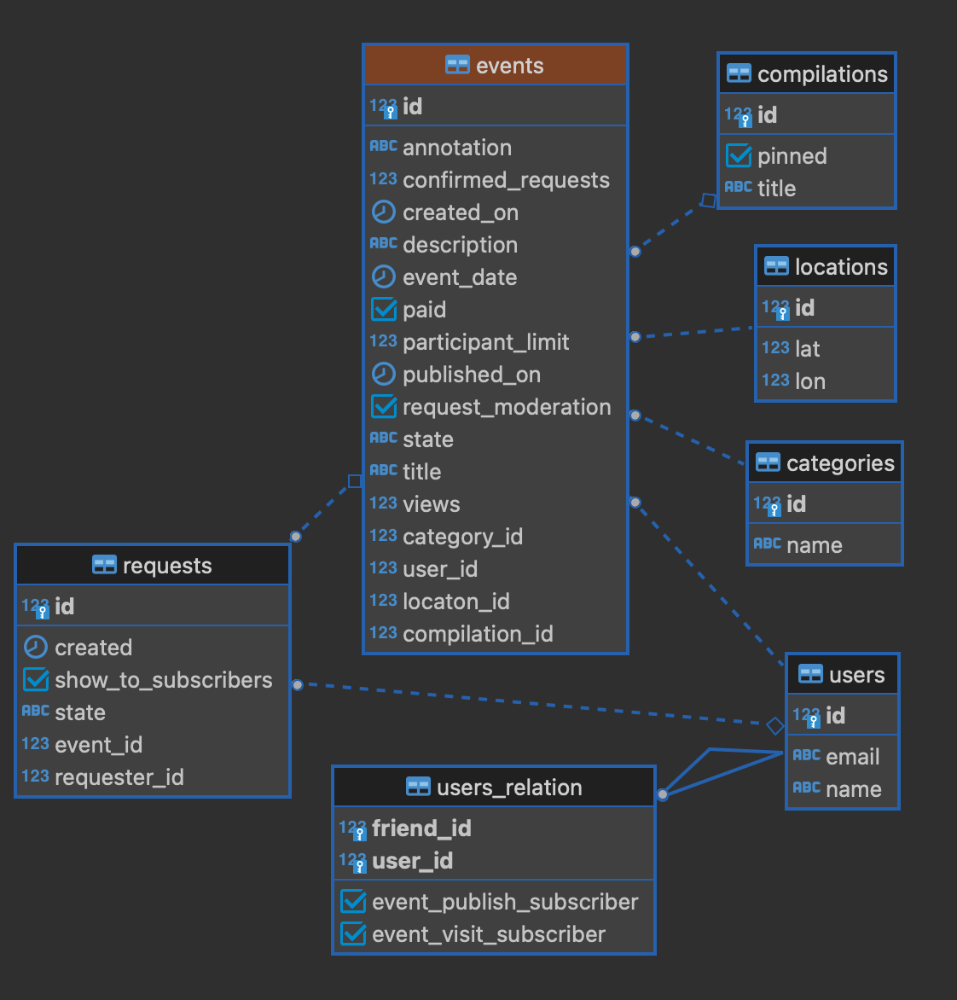

`# Explore-with-me
## Описание проекта 
Приложение Explore-with-me — афиша. В этой афише можно предложить какое-либо событие от выставки до похода в кино и собрать компанию для участия в нём.

Приложение разбито на 2 основных сервиса:
* ***основной сервис*** - содержит всё необходимое для работы продукта и основную его логику;
* ***сервис статистики*** - хранит количество просмотров и позволяет делать различные выборки для анализа работы приложения.

### Основной сервис
API основного сервиса разделена на три части:
* *публичная* - доступна без регистрации любому пользователю сети;
* *закрытая* - доступна только авторизованным пользователям;
* *административная* - для администраторов сервиса.

Сервис предоставляет возможности добавления, поиска и фильтрации событий привязанных к определенной категории. Присутствует возможность создания подборок событий по их тематике. Можно отправить запрос на участие в событии, который пройдет этап модерации при необходимости. 
Присутствует возможность добавлять пользователей в друзья и подписываться на события, которые они собираются посетить, либо на события, которые они публикуют. Каждый пользователь имеет возможность скрыть свое участие в определенном событии от своих друзей.
> ***Особенности реализации дружбы и подписок основного сервиса:***  
*Дружба является двустороненей, что означает отправленный запрос на дружбу должен быть обязательно подтвержден пользователем. Подтверждение дружбы со стороны пользователя, которому отправлен запрос происходит инструментами того же API, которым этот запрос был отправлен.
Это значит подтверждение дружбы происходит с точки зрения логики программы ответной отправкой заявки на дружбу. Идея реализации подписок содержит в себе формирование ленты событий для пользователя, который подписан на события других пользователей.
Подписываться на события можно только будучи друзьями.*
> 
### Сервис статистики
Сервис собирает информацию. Во-первых, о количестве обращений пользователей к спискам событий и, во-вторых, о количестве запросов к подробной информации о событии. На основе этой информации формируется статистика о работе приложения.

## Entity-Relationship диаграмма для основного сервиса

> ***Ссылка на pull Request:*** *[Explore-with-me Application](https://github.com/AhraAvidzba/java-explore-with-me/pull/5).*
